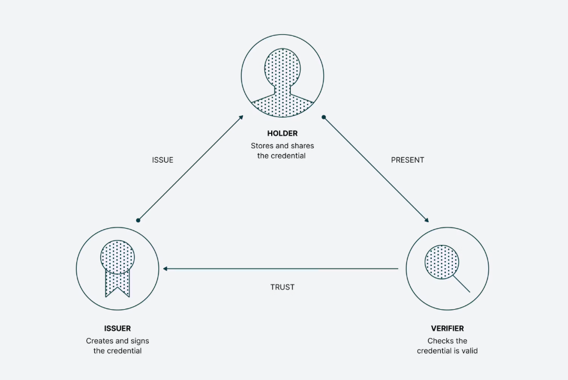

# SGI Trabalho 02

Repositório do Trabalho 02 de SGGI (Sistemas de Gestão de Identidade)

Universidade Lusófona Lisboa

---
## Contexto

### Aplicação Web
Esta aplicação web é implementada em Node.js/Express e simula um portal empresarial com múltiplos métodos de autenticação. 

A aplicação utiliza templates EJS para as vistas, sessões Express para gestão de estado, e um ficheiro JSON como base de dados local de utilizadores (dispensando a necessidade de um servidor de base de dados).

A aplicação inicial já suporta autenticação local (utilizador e palavra-passe). Em cada etapa do desenvolvimento, será adicionado um novo método de autenticação:
- Etapa 1: Autenticação SAML via IdP empresarial
- Etapa 2: Autenticação OpenID Connect via Google
- Etapa 3: Verificação de Verifiable Credentials

---
## Etapa 1: Service Provider SAML 2.0

#### Visão Geral

Implementação de autenticação SAML à aplicação web (Node/Express), transformando-a num Service Provider (SP) SAML capaz de autenticar utilizadores através de um Identity Provider (IdP) empresarial

#### Objetivos:
- Implementar funcionalidade de Service Provider SAML 2.0
- Configurar relações de confiança entre SP e IdP
- Processar asserções SAML e atributos de utilizador
- Compreender fluxos de single sign-on (SSO)

#### SAML em Ambientes Empresariais
O SAML (Security Assertion Markup Language) permite single sign-on entre aplicações empresariais.

Quando um utilizador tenta aceder a uma aplicação:
1. O Service Provider (SP) — a sua app — redireciona para o Identity Provider (IdP)
2. O IdP autentica o utilizador (se ainda não autenticado)
3. O IdP envia uma asserção SAML de volta para o SP
4. O SP valida a asserção e cria uma sessão

#### Aplicação e Identity Provider
A aplicação está configurada e disponível na URL: http://localhost:3000.

O IdP da unidade curricular é uma instância SimpleSAMLphp em **saml.jcraveiro.com**. 

Dados para comunicação SAML:

- (1) URL SSO do IdP (entry point): https://saml.jcraveiro.com/saml2/idp/SSOService.php
- (2) Entity ID do seu SP:http://localhost:3000/aXXXXXXXX
- (3) URL de Callback: http://localhost:3000/login/saml/callback
- (4) Certificado do IdP (para validação de assinaturas) 

#### Visão Geral do  fluxo SAML
```
Utilizador 	    ServiceProvider(SP)     IdentityProvider(IdP)
|                           |                       |
| Aceder app (localhost)    |                       |
|-------------------------> |                       |
|                           |                       |
| Redirecionar para IdP (1)                         |
|---------------------------------------------->    |
|                       |                           |
|                       | Utilizador faz login (2)  |
|                       |                           |
| Redirecionar de volta para SP com                 |
|   SAMLResponse (3)                                |
|<------------------------------------------------- |
|---------------------> |                           |
|                       |                           |
|                       | Validar asserção (4)      |
|                       |                           |
| Acesso concedido      |                           |
|<--------------------- |                           |
```

#### Desafios Encontrados no desenvolvimento da aplicação SAML

- Falta de familiaridade com Node.js / EJS
  - Dificuldade inicial em compreender a estrutura da aplicação em Node.js e o funcionamento do Express.  
  - Curva de aprendizagem associada ao uso de templates EJS para renderização de páginas dinâmicas.  
  - Necessidade de entender conceitos como rotas, middleware e separação entre lógica e apresentação.

- Configuração do certificado do IdP (`idpCert`)
  - Problemas ao configurar corretamente o certificado utilizado na autenticação SAML.  
  - Verificação de que o formato do certificado é crítico, funcionando apenas quando incluído entre: **BEGIN CERTIFICATE / END CERTIFICATE**.
  
- Serialização e desserialização do utilizador
  - Complexidade na gestão do objeto `user` após autenticação.  
  - Problemas ao implementar corretamente os métodos de serialização e desserialização.  
  - Impacto direto na apresentação correta dos dados do utilizador na página de perfil.

- Ausência do componente de logout SAML
  - Funcionalidade de logout SAML não estava inicialmente implementada.  
  - Implementação posterior com apoio do professor.  
  - Necessidade de compreender o fluxo de Single Logout (SLO) no contexto do SAML.  

---
## Etapa 2: Autenticação OpenID Connect via Google

#### Visão Geral

Implementação do **Google Sign-In** (OAuth 2.0 / OpenID Connect) permitindo que os utilizadores se autentiquem com as suas contas Google.

#### Objetivos:

- Implementar o fluxo authorization code do OAuth 2.0
- Configurar credenciais OAuth 2.0 no **Google Cloud Console**
- Processar tokens OIDC e dados de perfil do utilizador
- Suportar múltiplos métodos de autenticação numa aplicação

#### Configuração: Google Cloud Console
1. Criar um Projeto
   - Vá ao [Google Cloud Console](https://console.cloud.google.com/)
   - Clique em “Select a project” → “New Project”
   - Introduza o nome do projeto: SGI Trabalho 3
   - Clique em Create
2. Configurar o Ecrã de Consentimento OAuth
   - Selecione tipo de utilizador External
   - Preencha os campos obrigatórios:
     - App name: SGI Trabalho 3
     - User support email: conta Gmail
   - Clique em Save and Continue
   - Adicione scopes: email, profile, openid
   - Clique em Save and Continue
3. Criar Credenciais OAuth 2.0
   - Vá a APIs & Services → Credentials
   - Clique em Create Credentials → OAuth client ID
   - Tipo de aplicação: Web application
   - Nome: SGI Web App
   - Authorized redirect URIs:
   - Adicione: http://localhost:3000/login/google/callback
   - Clique em Create
   - Guardar o Client ID e Client Secret em lugar seguro
   
#### Descrição do Fluxo OAuth 2.0/OIDC
```
Utilizador        SGI Web                 Google Identity           Google APIs
(Client)          (OAuth Client)          Authorization Server      Resource Server
    |                    |                          |                       |
    | 1. Login com Google|                          |                       |
    |------------------->|                          |                       |
    |                    |                          |                       |
    |                    |  2. Redirect para Google |                       |
    |                    |     OAuth Consent Screen |                       |
    |                    |------------------------->|                       |
    |                    |                          |                       |
    | 3. Utilizador autentica-se e dá consentimento |                       |
    |---------------------------------------------->|                       |
    |                    |                          |                       |
    |                    | 4. Redirect com          |                       |
    |                    |    authorization_code    |                       |
    |                    |<-------------------------|                       |
    |                    |                          |                       |
    |                    | 5. Troca authorization_code por access_token     |
    |                    |------------------------->|                       |
    |                    |                          |                       |
    |                    | 6. Recebe access_token + id_token                |
    |                    |<-------------------------|                       |
    |                    |                          |                       |
    |                    | 7. Validar ID Token / obter perfil do utilizador |
    |                    |------------------------------------------------->|
    |                    |                                                  |
    |                    | 8. Dados do utilizador (email, profile, openid)  |
    |                    |<-----------------------------------------------  |
    |                    |                          |                       |
    | 9. Sessão autenticada no SGI                  |                       |
    |<-------------------|                          |                       |
```
#### Diretrizes segurança
Criar ficheiro **.env** para armazenar o secret, e não fazer commit no GIT (incluir em *.gitignore*):
```
GOOGLE_CLIENT_ID=o-seu-client-id-aqui
GOOGLE_CLIENT_SECRET=o-seu-client-secret-aqui
SESSION_SECRET=uma-string-secreta-aleatoria
```

---
## Etapa 3: Verificação de Verifiable Credentials

#### Visão Geral

Implementação de **autenticação com Verifiable Credentials (VCs)** permitindo que os utilizadores façam login apresentando uma credencial pré-emitida.

As Verifiable Credentials são atestados digitais assinados por um Emissor sobre um Titular, que podem ser apresentados a Verificadores com prova criptográfica de autenticidade e integridade.

#### Objetivos:

- Implementar verificação de VCs numa aplicação web
- Resolução de DIDs e verificação de assinaturas
- Processar claims de verifiable credentials
- Experienciar conceitos de identidade descentralizada

#### Contexto:

**Verifiable Credentials (VCs)** são um standard W3C para expressar credenciais na web de forma segura, respeitadora da privacidade e verificável por máquinas.

Conceitos-Chave
- Verifiable Credential: Claim assinada criptograficamente
- DID: Identificador Descentralizado
- DID Document: Contém métodos de verificação
- Verifiable Presentation: Pacote de credenciais assinado pelo holder
- Proof: Assinatura criptográfica garantindo autenticidade

#### Como é estabelecida a confiança?

O **triângulo da confiança** é um modelo envolvendo três partes, que sustenta como credenciais digitais são emitidas, compartilhadas e verificadas. Ele é a base para credenciais verificáveis e sistemas de identidade descentralizada.

É chamado de triângulo porque cada papel está ligado aos outros dois, mas cada um tem uma função distinta.
- Issuer: A entidade que cria e assina a credencial
- Holder: A entidade que possui a credencial
- Verifier: A entidade que solicita e verifica a credencial



#### Como isto difere de SAML/OIDC?
Ao contrário do SAML e OIDC onde um IdP tem de estar online, as VCs permitem:
- Verificação offline: Não é necessário contactar o issuer
- Controlo do utilizador: Utilizador escolhe o que partilhar
- Privacidade: Issuer não sabe quando a credencial é usada

| Aspeto | Tradicional (SAML/OIDC) | Verifiable Credentials |
|---------|-------------------------|------------------------|
| Arquitetura | Centralizada (IdP) | Descentralizada |
| Modelo de confiança | Issuer online | Issuer pode estar offline |
| Privacidade | IdP vê todos os logins | Sem rastreio pelo issuer |
| Portabilidade | Ligada ao IdP | Controlada pelo utilizador |
| Formato | SAML XML / JWT | JSON-LD / JWT |

####  O que precisaria um sistema de produção?

Nesta proposta de solução, a verificação de assinatura adota uma abordagem simplificada que verifica se a prova foi criada pelo issuer esperado. Esta verificação é feita apenas pela comparação do ID do issuer *DID* com o *verificationMethod*.

Em produção, é recomendado utilizar verificação criptográfica adequada:
- Resolver o DID do issuer para obter a chave pública
- Verifica a assinatura usando a chave pública do issuer

A prova criptográfica garante que a credencial foi emitida pelo Emissor declarado e não foi alterada desde a emissão.
